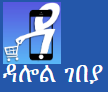

<html>
    <head>
        <title>
ecommerce web
        </title>
        
        <link rel="stylesheet" href="./ecocss/eco.css">
        
    </head>
    
    <body>
        <header>
        
        <h1 class="anu">እንኳን ወደ ዳሎል ገበያ በሰላም ገቡ</h1>
<section id="newsletter">

    <form>
        
        &nbsp; &nbsp; &nbsp; &nbsp; &nbsp; &nbsp; &nbsp; &nbsp; &nbsp; &nbsp; &nbsp; &nbsp; &nbsp; &nbsp;  &nbsp; &nbsp; &nbsp; &nbsp; &nbsp; &nbsp; &nbsp;&nbsp; &nbsp; &nbsp;&nbsp; &nbsp; &nbsp;&nbsp; &nbsp; &nbsp;&nbsp; &nbsp; &nbsp;&nbsp; &nbsp; &nbsp;&nbsp; &nbsp; &nbsp;&nbsp; &nbsp; &nbsp;&nbsp; &nbsp; &nbsp;&nbsp; &nbsp; &nbsp;&nbsp; &nbsp; &nbsp;&nbsp; &nbsp; &nbsp;
        <input type="email" placeholder="search">
        <button type="submit" class="button_1">search....</button>
    </form>

    
</section>
        <nav class=" navbar navbar-expand-lg navbar-light bg-white py-3 fixed-top">
            <select name="orderby" class="orderby" aria-label="Shop order">
                <option value="popularity"  selected='selected'>catagory</option>
                <option value="girl" >የሴት</option>
                <option value="date" >የወንድ</option>
                <option value="price" >ኮስሞቲክስ</option>
                <option value="price-desc" >የፎቶ እና የቪዲዮ እቃዎች</option>
                <option value="rating" >የቤት እቃዎች</option>
                <option value="date" >የስፖርት እቃዎች</option>
                <option value="price" >የድምጽና ሙዚቃ እቃዎች/option>
                <option value="price-desc" >የህጻናት አልባሳትና መቻወቻዎች</option>
        </select>
<a class="anan" href="shop.html">የሴት</a>
<a class="anan" href="boy">የወንድ</a>
<a class="anan"href="cosmotics">ኮስሞቲክስ</a>
<a class="anan"href="photography">የፎቶ እና የቪዲዮ እቃዎች</a>
<a class="anan"href="house material">የቤት እቃዎች</a>
<a class="anan"href="sport">የስፖርት እቃዎች</a>
<a class="anan"href="music">የድምጽና ሙዚቃ እቃዎች</a>
<a class="anan"href="kids">የህጻናት አልባሳትና መቻወቻዎች</a>
</nav>
</header>
<h2>&nbsp;&nbsp;&nbsp;&nbsp;ቤትዎ  ተቀምተው  ይገበያዩ ! </h2>

<fotter id="fotter">
   anu@copyright 2014
</fotter>
    </body>
</html>
